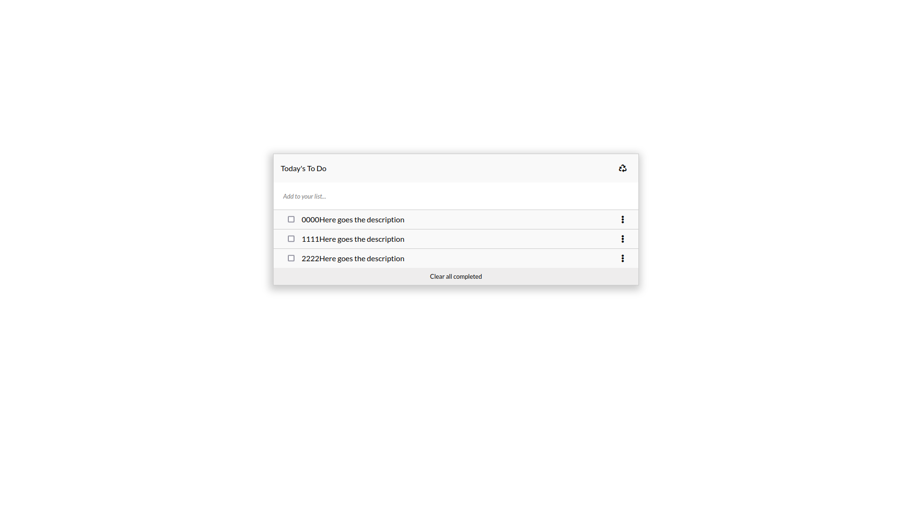

# To Do List

> In this project I made a to list by usign JS, webpack.

## Built With

- HTML&CSS, JavaScript
- Webpack

## Live Demo

[Live Demo](https://luftedar.github.io/todo-list/dist/)

## Getting Started

For Cloning Repository:

- git clone git@github.com:luftedar/todo-list.git

- cd into todo-list

- npm install

- npm start

### Prerequisites

- Webpack, Internet Browser, Note Editor

## Authors

👤 **Orçun Uğur**

- GitHub: [@githubhandle](https://github.com/luftedar)
- Twitter: [@twitterhandle](https://twitter.com/OrcunUgur2)
- LinkedIn: [LinkedIn](https://www.linkedin.com/in/or%C3%A7un-u%C4%9Fur-089148181/)

## 🤝 Contributing

Contributions, issues, and feature requests are welcome!

Feel free to check the [issues page](../../issues/).

## Show your support

Give a ⭐️ if you like this project!

## 📝 License

This project is [MIT](./MIT.md) licensed.
